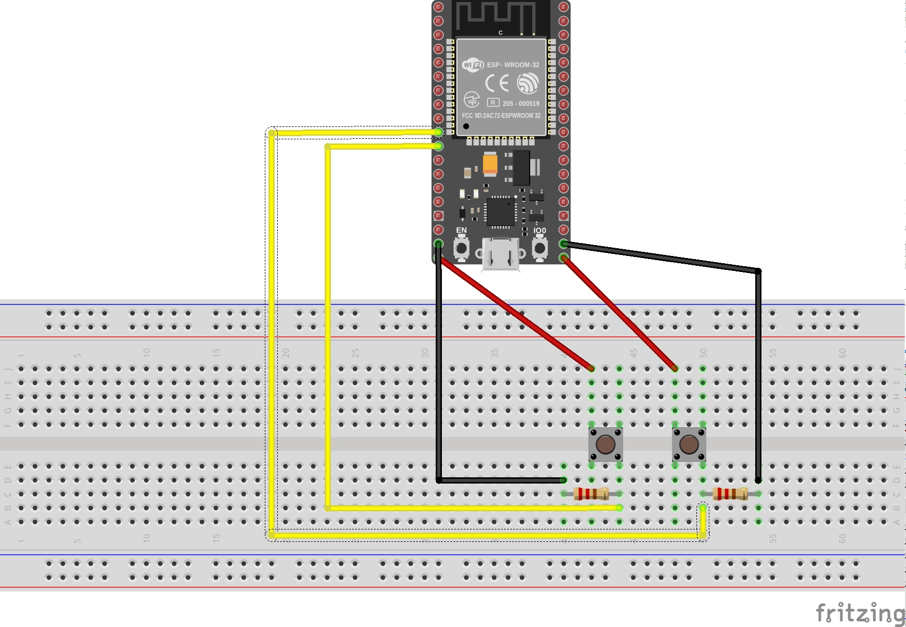
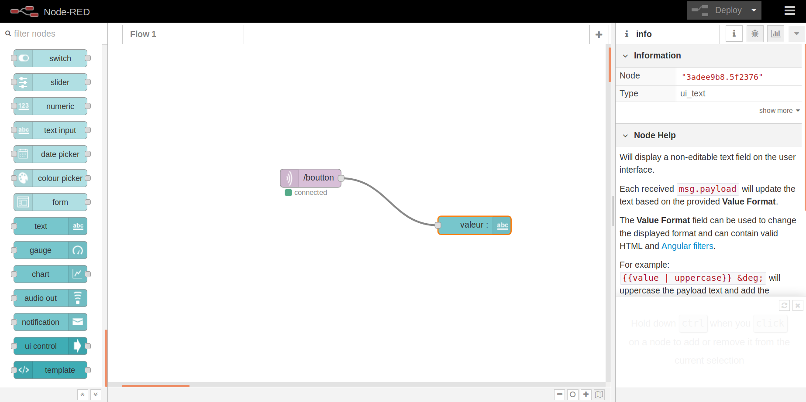

# BoutonDASH
Ce projet à été réalisé par [@WiLDCaT](https://github.com/wildcat7534); [@OlgaBd](https://github.com/olgaBd)
# VIDEO

## BIBLIOTHEQUE UTILISEE
+ WiFi.h
+ Adafruit_MQTT.h
+ Adafruit_MQTT_Client.h
+ uTimerLib.h

## MATERIEL
- Bread Bord
- Carte ESP32
- 2 BoutonDASH
- 2 RESISTANCE 

## SCHEMA ELECTRIQUE

## NODE-RED

